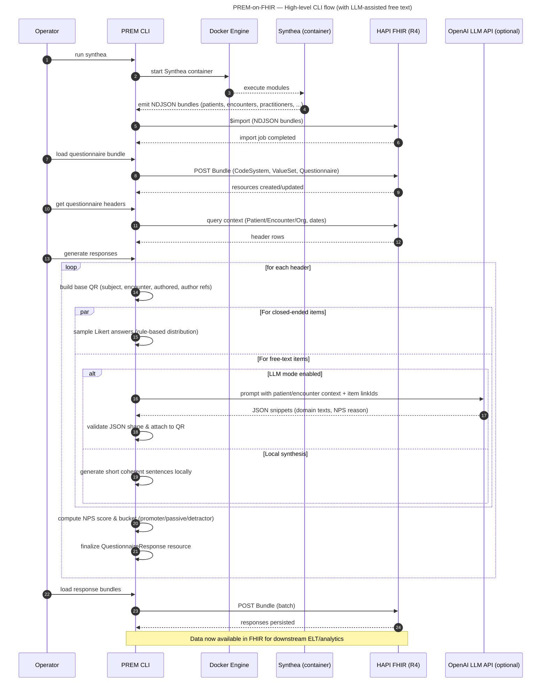

```mermaid
sequenceDiagram
    title: PREM-on-FHIR — High-level CLI flow (with LLM-assisted free text)

    autonumber
    participant U as Operator
    participant CLI as PREM CLI
    participant Docker as Docker Engine
    participant Synthea as Synthea (container)
    participant HAPI as HAPI FHIR (R4)
    participant LLM as OpenAI LLM API (optional)

    %% 1) Generate base entities with Synthea
    U->>CLI: run synthea
    CLI->>Docker: start Synthea container
    Docker-->>Synthea: execute modules
    Synthea-->>CLI: emit NDJSON bundles (patients, encounters, practitioners, ...)

    %% 2) Load Synthea bundles into HAPI (bulk)
    CLI->>HAPI: $import (NDJSON bundles)
    HAPI-->>CLI: import job completed

    %% 3) Load PREM questionnaire assets
    U->>CLI: load questionnaire bundle
    CLI->>HAPI: POST Bundle (CodeSystem, ValueSet, Questionnaire)
    HAPI-->>CLI: resources created/updated

    %% 4) Extract minimal headers for QuestionnaireResponse creation
    U->>CLI: get questionnaire headers
    CLI->>HAPI: query context (Patient/Encounter/Org, dates)
    HAPI-->>CLI: header rows

    %% 5) Generate QuestionnaireResponses (per header)
    U->>CLI: generate responses
    loop for each header
      CLI->>CLI: build base QR (subject, encounter, authored, author refs)
      par For closed-ended items
        CLI->>CLI: sample Likert answers (rule-based distribution)
      and For free-text items
        alt LLM mode enabled
            CLI->>LLM: prompt with patient/encounter context + item linkIds
            LLM-->>CLI: JSON snippets (domain texts, NPS reason)
            CLI->>CLI: validate JSON shape & attach to QR
        else Local synthesis
            CLI->>CLI: generate short coherent sentences locally
        end
      end
      CLI->>CLI: compute NPS score & bucket (promoter/passive/detractor)
      CLI->>CLI: finalize QuestionnaireResponse resource
    end

    %% 6) Load QuestionnaireResponses
    U->>CLI: load response bundles
    CLI->>HAPI: POST Bundle (batch)
    HAPI-->>CLI: responses persisted

    note over CLI,HAPI: Data now available in FHIR for downstream ELT/analytics
```