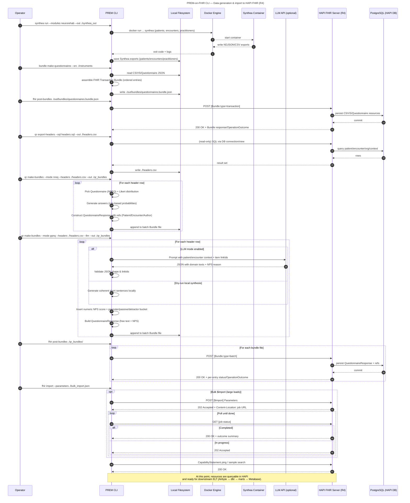

```mermaid
sequenceDiagram
    title: PREM-on-FHIR CLI — Data generation & import to HAPI FHIR (R4)

    autonumber
    participant U as Operator
    participant CLI as PREM CLI
    participant FS as Local Filesystem
    participant Docker as Docker Engine
    participant Synthea as Synthea Container
    participant LLM as LLM API (optional)
    participant HAPI as HAPI FHIR Server (R4)
    participant PG as PostgreSQL (HAPI DB)

    %% -- A) Generate base clinical entities with Synthea
    U->>CLI: synthea run --modules neurorehab --out ./synthea_out
    CLI->>Docker: docker run ... synthea (patients, encounters, practitioners)
    Docker-->>Synthea: start container
    Synthea-->>Docker: write NDJSON/CSV exports
    Docker-->>CLI: exit code + logs
    CLI->>FS: save Synthea exports (patients/encounters/practitioners)

    %% -- B) Prepare PREM instruments (CodeSystem/ValueSet/Questionnaire) as a Bundle
    U->>CLI: bundle make-questionnaires --src ./instruments
    CLI->>FS: read CS/VS/Questionnaire JSON
    CLI->>CLI: assemble FHIR Transaction Bundle (ordered entries)
    CLI->>FS: write ./out/bundles/questionnaires.bundle.json

    %% -- C) Load instruments into HAPI
    U->>CLI: fhir post-bundles ./out/bundles/questionnaires.bundle.json
    CLI->>HAPI: POST [Bundle type=transaction]
    HAPI->>PG: persist CS/VS/Questionnaire resources
    PG-->>HAPI: commit
    HAPI-->>CLI: 200 OK + Bundle response/OperationOutcome

    %% -- D) Export minimal headers for QuestionnaireResponses (context)
    U->>CLI: qr export-headers --sql headers.sql --out ./headers.csv
    CLI->>HAPI: (read-only) SQL via DB connection/view
    HAPI->>PG: query patient/encounter/org/context
    PG-->>HAPI: rows
    HAPI-->>CLI: result set
    CLI->>FS: write ./headers.csv

    %% -- E) Generate QuestionnaireResponses (two modes)
    U->>CLI: qr make-bundles --mode nreq --headers ./headers.csv --out ./qr_bundles
    loop For each header row
      CLI->>CLI: Pick Questionnaire (NREQ) + Likert distribution
      CLI->>CLI: Generate answers (rule-based probabilities)
      CLI->>CLI: Construct QuestionnaireResponse with refs (Patient/Encounter/Author)
      CLI->>FS: append to batch Bundle file
    end

    U->>CLI: qr make-bundles --mode ppnq --headers ./headers.csv --llm --out ./qr_bundles
    loop For each header row
      alt LLM mode enabled
        CLI->>LLM: Prompt with patient/encounter context + item linkIds
        LLM-->>CLI: JSON with domain texts + NPS reason
        CLI->>CLI: Validate JSON shape & linkIds
      else Dry-run local synthesis
        CLI->>CLI: Generate coherent short sentences locally
      end
      CLI->>CLI: Insert numeric NPS score + promoter/passive/detractor bucket
      CLI->>CLI: Build QuestionnaireResponse (free text + NPS)
      CLI->>FS: append to batch Bundle file
    end

    %% -- F) Upload QR Bundles (two paths)
    U->>CLI: fhir post-bundles ./qr_bundles/
    loop For each bundle file
        CLI->>HAPI: POST [Bundle type=batch]
        HAPI->>PG: persist QuestionnaireResponse + refs
        PG-->>HAPI: commit
        HAPI-->>CLI: 200 OK + per-entry status/OperationOutcome
    end

    U->>CLI: fhir import --parameters ./bulk_import.json
    opt Bulk $import (large loads)
        CLI->>HAPI: POST [$import] Parameters
        HAPI-->>CLI: 202 Accepted + Content-Location: job URL
        loop Poll until done
            CLI->>HAPI: GET [job status]
            alt Completed
                HAPI-->>CLI: 200 OK + outcome summary
            else In progress
                HAPI-->>CLI: 202 Accepted
            end
        end
    end

    %% -- G) Post-load checks & handoff to analytics (outside CLI scope)
    CLI->>HAPI: CapabilityStatement ping / sample search
    HAPI-->>CLI: 200 OK
    Note over CLI,HAPI: At this point, resources are queryable in HAPI<br/>and ready for downstream ELT (Airbyte → dbt → marts → Metabase).
```