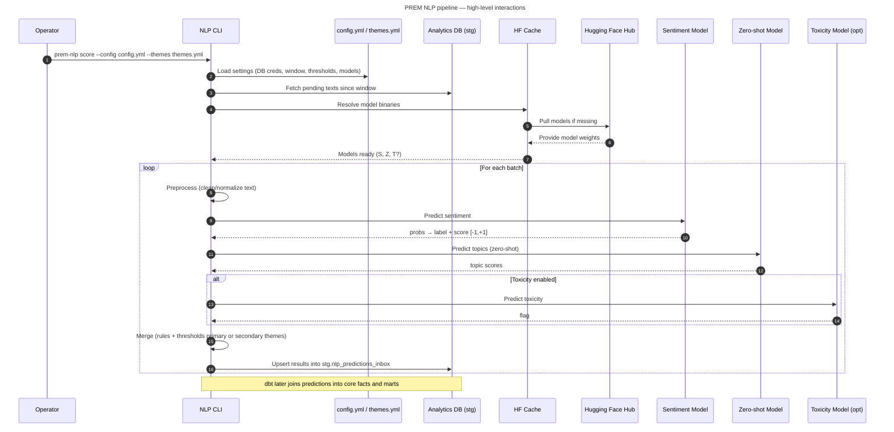

```mermaid
sequenceDiagram
    title: PREM NLP pipeline — high-level interactions
    autonumber
    participant Op as Operator
    participant CLI as NLP CLI
    participant CFG as config.yml / themes.yml
    participant DB as Analytics DB (stg)
    participant Cache as HF Cache
    participant HF as Hugging Face Hub
    participant S as Sentiment Model
    participant Z as Zero-shot Model
    participant T as Toxicity Model (opt)

    Op->>CLI: prem-nlp score --config config.yml --themes themes.yml
    CLI->>CFG: Load settings (DB creds, window, thresholds, models)
    CLI->>DB: Fetch pending texts since window
    CLI->>Cache: Resolve model binaries
    Cache->>HF: Pull models if missing
    HF-->>Cache: Provide model weights
    Cache-->>CLI: Models ready (S, Z, T?)

    loop For each batch
        CLI->>CLI: Preprocess (clean/normalize text)
        CLI->>S: Predict sentiment
        S-->>CLI: probs → label + score [-1,+1]
        CLI->>Z: Predict topics (zero-shot)
        Z-->>CLI: topic scores
        alt Toxicity enabled
            CLI->>T: Predict toxicity
            T-->>CLI: flag
        end
        CLI->>CLI: Merge (rules + thresholds primary or secondary themes)
        CLI->>DB: Upsert results into stg.nlp_predictions_inbox
    end

    note over CLI,DB: dbt later joins predictions into core facts and marts
```