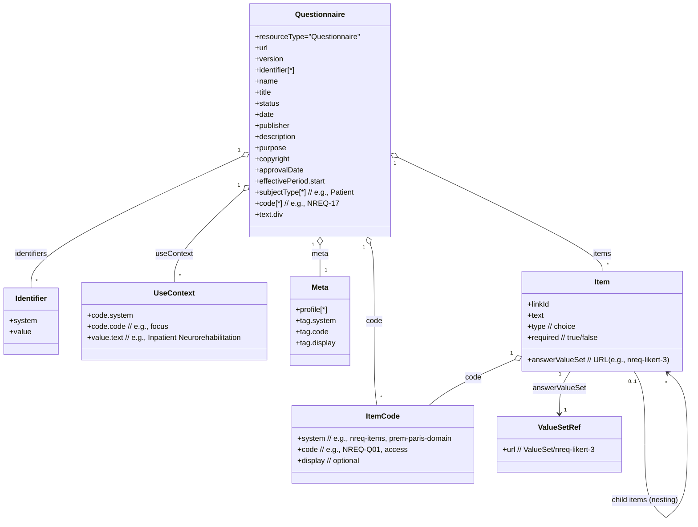

```mermaid
classDiagram
    class Questionnaire {
      +resourceType="Questionnaire"
      +url
      +version
      +identifier[*]
      +name
      +title
      +status
      +date
      +publisher
      +description
      +purpose
      +copyright
      +approvalDate
      +effectivePeriod.start
      +subjectType[*]   // e.g., Patient
      +code[*]          // e.g., NREQ-17
      +text.div
    }

    class Identifier {
      +system
      +value
    }

    class UseContext {
      +code.system
      +code.code      // e.g., focus
      +value.text     // e.g., Inpatient Neurorehabilitation
    }

    class Meta {
      +profile[*]
      +tag.system
      +tag.code
      +tag.display
    }

    class Item {
      +linkId
      +text
      +type           // choice
      +required       // true/false
      +answerValueSet // URL (e.g., nreq-likert-3)
    }

    class ItemCode {
      +system         // e.g., nreq-items, prem-paris-domain
      +code           // e.g., NREQ-Q01, access
      +display        // optional
    }

    class ValueSetRef {
      +url            // ValueSet/nreq-likert-3
    }

    %% Relationships
    Questionnaire "1" o-- "*" Identifier : identifiers
    Questionnaire "1" o-- "*" UseContext : useContext
    Questionnaire "1" o-- "1" Meta : meta
    Questionnaire "1" o-- "*" Item : items
    Questionnaire "1" o-- "*" ItemCode : code

    Item "1" o-- "*" ItemCode : code
    Item "1" --> "1" ValueSetRef : answerValueSet
    Item "0..1" --> "*" Item : child items (nesting)

    %% Notes for your instance:
    %% - 17 Item nodes (nreq-q1..nreq-q17), each with:
    %%   * one nreq-items code (NREQ-Qxx)
    %%   * one PaRIS domain code (e.g., access, continuity, trust)
    %%   * shared ValueSet = nreq-likert-3

```