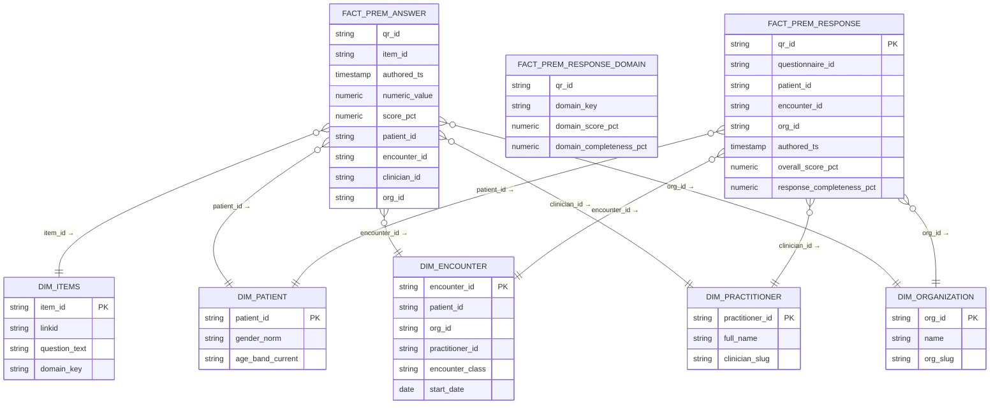

```mermaid
erDiagram
  %% === Dimensions (key fields only) ===
  DIM_ITEMS {
    string item_id PK
    string linkid
    string question_text
    string domain_key
  }

  DIM_ORGANIZATION {
    string org_id PK
    string name
    string org_slug
  }

  DIM_PATIENT {
    string patient_id PK
    string gender_norm
    string age_band_current
  }

  DIM_PRACTITIONER {
    string practitioner_id PK
    string full_name
    string clinician_slug
  }

  DIM_ENCOUNTER {
    string encounter_id PK
    string patient_id
    string org_id
    string practitioner_id
    string encounter_class
    date   start_date
  }

  %% === Facts (key fields only) ===
  FACT_PREM_ANSWER {
    string qr_id
    string item_id
    timestamp authored_ts
    numeric numeric_value
    numeric score_pct
    string patient_id
    string encounter_id
    string clinician_id
    string org_id
  }

  FACT_PREM_RESPONSE_DOMAIN {
    string qr_id
    string domain_key
    numeric domain_score_pct
    numeric domain_completeness_pct
  }

  FACT_PREM_RESPONSE {
    string qr_id PK
    string questionnaire_id
    string patient_id
    string encounter_id
    string org_id
    timestamp authored_ts
    numeric overall_score_pct
    numeric response_completeness_pct
  }

  %% === Relationships ===
  FACT_PREM_ANSWER }o--|| DIM_ITEMS        : "item_id →"
  FACT_PREM_ANSWER }o--|| DIM_PATIENT      : "patient_id →"
  FACT_PREM_ANSWER }o--|| DIM_ENCOUNTER    : "encounter_id →"
  FACT_PREM_ANSWER }o--|| DIM_PRACTITIONER : "clinician_id →"
  FACT_PREM_ANSWER }o--|| DIM_ORGANIZATION : "org_id →"

  FACT_PREM_RESPONSE }o--|| DIM_PATIENT      : "patient_id →"
  FACT_PREM_RESPONSE }o--|| DIM_ENCOUNTER    : "encounter_id →"
  FACT_PREM_RESPONSE }o--|| DIM_PRACTITIONER : "clinician_id →"
  FACT_PREM_RESPONSE }o--|| DIM_ORGANIZATION : "org_id →"

  %% Domain fact is tied to QR and item metadata (implicit via joins)
```